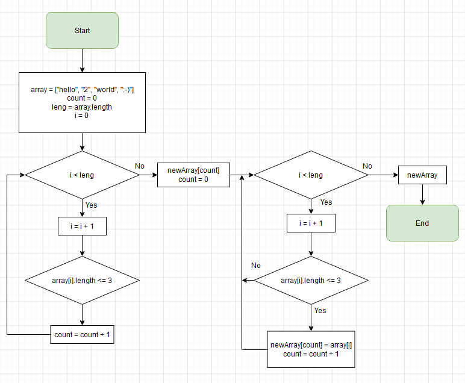

## **Программа решающая поставленную задачу**

1. Основной код записан в методе "GetArrayLength".
2. Строчный массив взят строго из примеров задания, который выводиться void-методом "ShowArray".
3. Далее выводим наш новый массив, который и является решением поставленной задачи.

